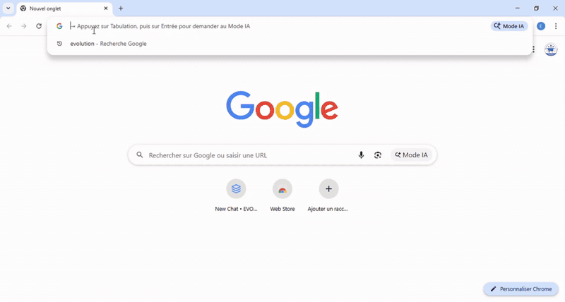

# EVOLUTICS — Votre tremplin vers le monde professionnel

<div align="center">
  
  <br/><br/>

  
  
  
  <br/>
  
  
  
  <br/>
  
  
  

  <br/>
  <p><strong>Trouvez toutes vos opportunités au même endroit. Candidatez mieux grâce à l'IA. Réussissez plus.</strong></p>

  <p>
    <a href="#à-propos-devolutics">À propos</a> •
    <a href="#guide-dinstallation">Installation</a> •
    <a href="#léquipe-evolutics">Équipe</a>
  </p>
</div>

---

## Découvrez EVOLUTICS en action

<div align="center">
  
  <br/><br/>
  <p>
    <strong>Ceci est un aperçu de 30 secondes</strong><br/>
    Pour voir toutes les fonctionnalités en détail :<br/>
    <a href="#"><strong>Regarder la présentation complète (1min40)</strong></a>
  </p>
</div>

---

## Cahier des Charges

**Pour consulter le cahier des charges complet du projet EVOLUTICS :**

[Cahier des Charges EVOLUTICS](./EVOLUTICS_CAHIER__DE_CHARGE.pdf)

---

## À propos d'EVOLUTICS

### 🎯 Le Défi
Les étudiants perdent un temps précieux à naviguer entre des dizaines de plateformes pour trouver des opportunités. Résultat : ils ratent des offres, peinent à bien candidater et se sentent perdus face au jargon professionnel.

### 💡 Notre Solution
**EVOLUTICS centralise tout en un seul endroit.** Fini les onglets multiples et la recherche dispersée.

---

## 🚀 Ce qu'EVOLUTICS vous offre

<table>
<tr>
<td width="33%" valign="top">

### 📍 **Hub Centralisé**
- **Agrégation multi-sources**
  Collecte automatique depuis plusieurs plateformes
- **Filtrage intelligent**
  Résultats adaptés à votre profil
- **Alertes personnalisées**
  Ne ratez plus aucune opportunité

</td>
<td width="33%" valign="top">

### 🤖 **Assistant IA**
- **Rédaction optimisée**
  CV adaptés à chaque offre
- **Décryptage technique**
  Explication du jargon professionnel
- **Conseils sur mesure**
  Amélioration de vos candidatures

</td>
<td width="33%" valign="top">

### 🛠️ **Outils Pro**
- **CV Builder** ✅
  Templates modernes et optimisés
- **Lettres de motivation** 🔄
  Génération personnalisée
- **Préparation entretiens** 🔄
  Simulation avec feedback IA

</td>
</tr>
</table>

---

## 🚀 Guide d'Installation

<details>
<summary><strong>📋 Prérequis (cliquez pour développer)</strong></summary>

- **Node.js 18+** installé sur votre machine
- Compte **Supabase** (gratuit)
- Clé API **Google Gemini** (gratuite)

</details>

### ⚡ Installation en 5 étapes

```bash
# 1️⃣ Cloner le repository
git clone https://github.com/Bsh54/EVOLUTICS_HACKBYIFRI_2026.git
cd EVOLUTICS_HACKBYIFRI_2026/all-model-chat

# 2️⃣ Installer les dépendances
npm install

# 3️⃣ Configuration environnement
# Créer le fichier .env.local avec :
VITE_SUPABASE_URL=votre_url_supabase
VITE_SUPABASE_ANON_KEY=votre_cle_supabase
VITE_GEMINI_API_KEY=votre_cle_gemini

# 4️⃣ Configurer la base de données
# Copier le contenu de supabase_schema.sql dans l'éditeur SQL Supabase

# 5️⃣ Lancer l'application
npm run dev
```

> 🌐 **L'application sera accessible sur** `http://localhost:5173`

---

## 👥 L'équipe EVOLUTICS

<div align="center">

### 🏆 **HACKBYIFRI 2026** - Institut de Formation et de Recherche en Informatique (IFRI)

<br>

<table align="center">
<tr>
<th width="25%">👤 Membre</th>
<th width="25%">🎯 Rôle</th>
<th width="25%">🎓 Spécialité</th>
<th width="25%">📧 Contact</th>
</tr>
<tr>
<td align="center"><strong>Shadrak BESSANH</strong></td>
<td align="center">Chef d'équipe</td>
<td align="center">SEIOT Licence 2</td>
<td align="center"><a href="mailto:shadrakbsh@gmail.com">shadrakbsh@gmail.com</a></td>
</tr>
<tr>
<td align="center"><strong>Marlyse BOUKARI</strong></td>
<td align="center">Développeuse</td>
<td align="center">Sécurité Informatique L2</td>
<td align="center"><a href="mailto:marlyseboukari@gmail.com">marlyseboukari@gmail.com</a></td>
</tr>
<tr>
<td align="center"><strong>Othniel AGUIDI</strong></td>
<td align="center">Développeur IA</td>
<td align="center">Intelligence Artificielle L2</td>
<td align="center"><a href="mailto:aguidiothiniel17@gmail.com">aguidiothiniel17@gmail.com</a></td>
</tr>
</table>

<br>

---

<div align="center">
  ⭐ **N'oubliez pas de mettre une étoile si ce projet vous plaît !** ⭐
</div>

</div>